<center>
<strong>
<font face='微软雅黑' size=6> SJTU_soso设计文档 </font>
</strong>
</center>

<p align="right">
<font face='微软雅黑' size=4>郭建铭/廖宁祎/刘浩文/江浩宇/郭子豪</font>
</p>

&emsp;&emsp;
项目的结构图如下所示，主要模块为**信息聚合检索**、**智能推荐平台**、**社交博客平台**、**后台管理平台**。本设计文档将按照四个模块详细展开阐述。

<div align=center>
	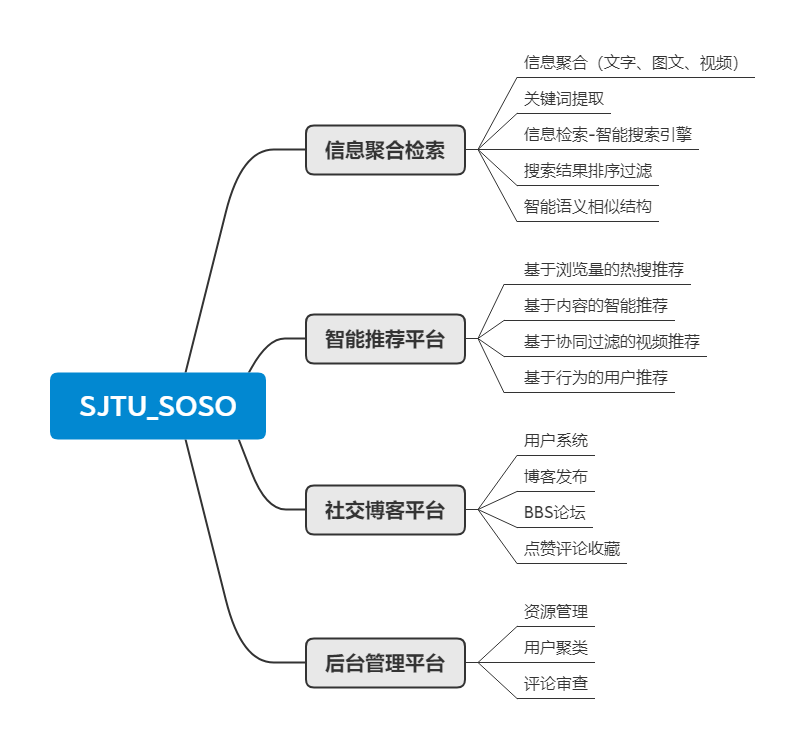
</div>


# 1 信息聚合检索

## 1.1 基于scrapy的信息获取

###  1）实现机制

&emsp;&emsp;
Scrapy 是基于 Python 的框架，具有高层次、集成度好等特点，且能与 Django ORM 衔接，完成爬取数据、清洗整理、数据库存储的全pipeline。

### 2）数据来源

&emsp;&emsp;
需要获取的数据包括文章、视频、图片等，信息来源包括校级网站、院级网站和一些主流公众后平台。详细图示如下。

<div align=center>
	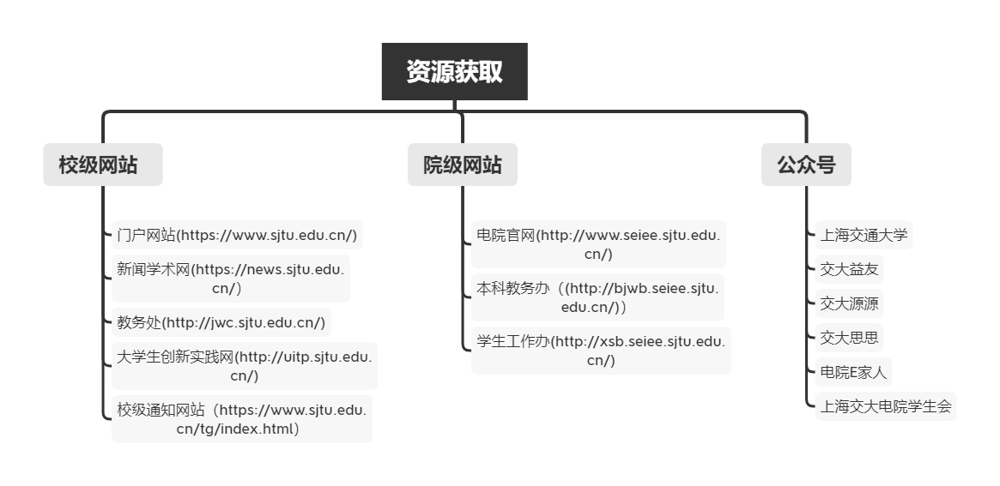
</div>

&emsp;&emsp;
针对每篇通知、公告等需要获取的具体信息包括标题、发布日期、正文、浏览量、网址、所属种类等。以教务处某篇通知为例，利用BeautifulSoup解析网页后在每个分区遍历搜索每一个子链接节点，进入详情页后利用xpath定位相关信息获取，进行简单的过滤和预处理后存储。

<div align=center>
	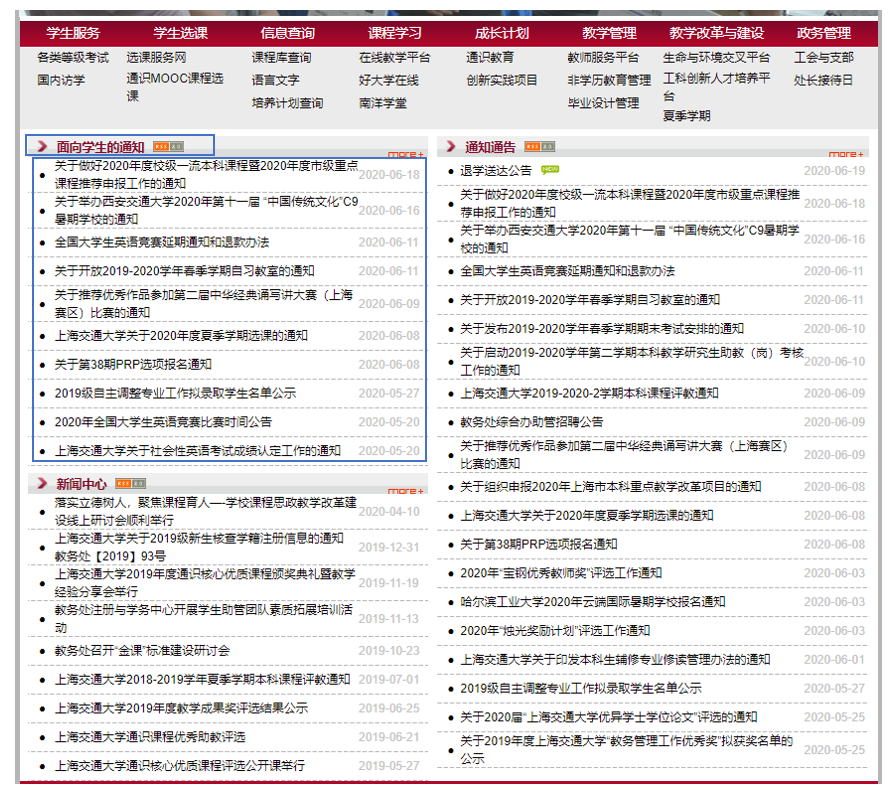
</div>


<div align=center>
	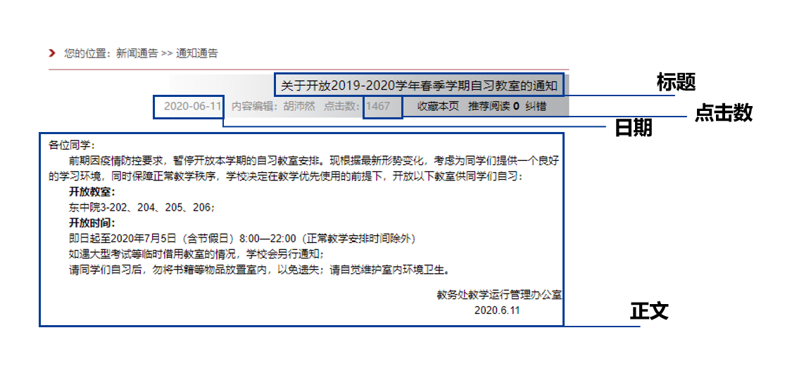
</div>

### 3）模块接口

&emsp;&emsp;
模块为在 Django 项目目录下的 `SJTUsoso/crawl/` 目录，其亦作为一个 Scrapy 项目存在。实现以电院新闻的爬虫为例，配置在 `SJTUsoso/crawl/crawl/spiders/seiee.py` 中。

&emsp;&emsp;
配置后，在 `SJTUsoso/crawl/` 目录下使用如下 Scrapy 命令运行，即可即时爬取数据并写入数据库中。
```sh
scrapy crawl seiee
```

### 4）与 Django 对接

&emsp;&emsp;
为在运行 Scrapy 时启动 Django 服务，在配置文件 `settings.py` 中需要如下语句。
```python
BASE_DIR = os.path.dirname(os.path.dirname(os.path.dirname(os.path.abspath(__file__))))
sys.path.append(BASE_DIR)
os.environ['DJANGO_SETTINGS_MODULE'] = 'SJTUsoso.settings'
django.setup()
```

&emsp;&emsp;
模型方面，Scrapy 模型直接继承 Django 对应数据模型 `soso.models.SosoSitearticle` 即可。见 `items.py`。
```python
from scrapy_djangoitem import DjangoItem
from soso.models import SosoSitearticle
class ArticleItem(DjangoItem):
    django_model = SosoSitearticle
```

&emsp;&emsp;
在处理文件 `pipelines.py` 中，加入将模型实例保存到 Django 数据库中的语句。
```python
class CrawlPipeline(object):
    def process_item(self, item, spider):
        item.save()
        return item
```

## 1.2 基于Text-Rank算法的全文关键词提取

### 1）实现机制

&emsp;&emsp;
对于网页新闻数据，使用成熟的 NLP 关键词提取方法进行静态关键词分析，取最重要三者作为该条数据的关键词。
* 使用经典的无监督抽取式文本摘要算法 Text-Rank，基于文中词语的相似性构建图结构，再由权重得分得到词语的重要性排序。该方法适用于大量文本的快速分析，同时基于每篇文章相似性图的提取效果也比基于语料库的算法更有针对性。
* 调用结巴中文分词相关接口实现，分词可与其他 NLP 部分共用相同的结巴语料库。

### 2）模块接口

&emsp;&emsp;
提取关键词的接口主要为 `SJTUsoso/soso/genKw.get_kw()`，输入文本字符串（一般为标题加正文），返回前三关键词列表，供建立/更新文章数据时调用。实现针对数据中常见的短文本做了专门处理，使关键词个数不少于三个。

## 1.3 数据库的建立

&emsp;&emsp;
为了提高项目的功能性和兼容性，聚合获取的所有数据建立远端数据库存储。远端数据库的搭建详见部署文档。为与Django项目交互，此部分所有数据存放于表SJTUsoso.soso_siteArticle。表单解释列表如下。

<div align=center>
	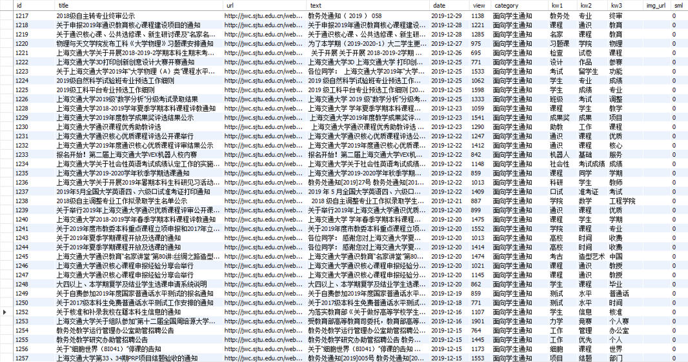
</div>

<style>
table {
margin: auto;
}
</style>


| 表项    |  说明 | 
|:----:| :----:|
| id |   主码，每条记录的标识符|
| title | 标题 |
| url | 原网站链接 |
| text |  正文内容|
| date  | 发布日期  |
| view  | 浏览量  
| category | 信息所属种类
| kw | 正文关键词提取
|img_url| 若包含图片，图片地址
| sml | 临时相似度缓存

&emsp;&emsp;
为使项目与所建立数据库进行交互，在settings.py下定义数据库配置信息。

```python
DATABASES = {
    'default': {
        'ENGINE': 'django.db.backends.mysql',
        'NAME': 'SJTUsoso',
        'USER':'soso',
        'PASSWORD':'SJTUsoso',
        'HOST': '39.100.88.210',
        'PORT': '3306',
        'TEST': {
            'CHARSET': 'utf8',
            'COLLATION': 'utf8_general_ci'
        }
    }
}
```

## 1.4 基于 BERT 模型的动态语义相似度分析

### 1）实现机制

&emsp;&emsp;
语义相似度分析是对搜索请求字符串和搜索引擎返回的搜索结果各条目模型进行动态分析的数据处理。我们将语义相似度分析应用于对搜索结果的智能排序上
* 语义相似度分析任务实际上是一个句子对的二分类任务，两句子相似/不相似的类别标签各为1/0，则模型对归类的输出为0至1之间的一个实数，将其作为相似度指标，越接近1则句子间越相似。
* 调用模型的机器学习框架为 TensorFlow，与 BERT 模型的接口参考 [terrifyzhao/bert-utils](https://github.com/terrifyzhao/bert-utils) 项目实现。
* NLP 模型为 [Google BERT](https://github.com/google-research/bert)-Base Chinese 模型，针对相似度分析（句子对分类）任务，模型结构略有调整，如下所示。模型的具体训练与部署部分见部署文档。

<div align=center>
	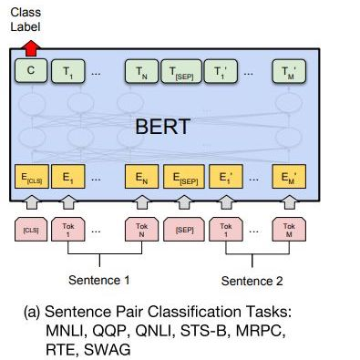
</div>

### 2）模块接口

&emsp;&emsp;
由于 Django-Haystack 搜索框架的限制，搜索结果的动态分析实现较为复杂。具体而言，Haystack 框架的搜索结果类 `SearchQuerySet` 不提供 Django 原生对应类的 `extra()` 方法，因此对于分析结果列，无法使用动态的排序方法。此处经过多种实现的尝试，最后采用在网页新闻 `soso_sitearticle` 数据模型中增加一静态列 `sml` 作为临时相似度缓存来解决上述问题。
* `bert-utils-master/similar.py`：参考并自行重写的相似度分析任务实现：
    * 声明了相似度模型类 `BertSim`；
    * 通过调用相似度分析方法 `BertSim.predict()`，输入二字符串，输出预测的相似度值。
* `SJTUsoso/soso/bert_run.py`：主要模型调用部分：
    * 在初次调用时实例化全局模型；
    * 提供封装的 `get_similarity()` 方法计算相似度。
* `SJTUsoso/soso/views.py` 中，自定义搜索结果视图类的方法 `mySearchView.get_queryset()` ：在进行相似度排序时：
    * 根据 GET 参数获取搜索请求；
    * 遍历搜索结果，根据请求和结果文本调用 `get_similarity()` 计算相似度，写入 `sml` 列中；
    * 对 `sml` 列进行排序，返回排序后的搜索结果类，供前端展示。

## 1.5 搭建搜索引擎

### 1）全文搜索引擎概述

&emsp;&emsp;
全文检索技术以各类数据如文本、声音、图像等为对象，提供按数据的内容而不是外在特征来进行的信息检索，其特点是能对海量的数据进行有效管理和快速检索。该检索技术可跨越所有的数据源，支持多种数据和信息格式，对检索结果可按商业分类规则进行排列，也能满足用户特定的知识检索请求，将所有不同信息查询中的命中结果按相关性或分类排列，提供不同格式的信息浏览功能。

&emsp;&emsp;
从搜索结果来源的角度，全文搜索引擎又可细分为两种，一种是拥有自己的检索程序，并自建网页数据库，搜索结果直接从自身的数据库中调用，如Google、Fast/AllThe Web、AltaVista、Inktomi、Teoma、WiseNut、百度等；另一种则是租用其他引擎的数据库，并按自定的格式排列搜索结果，如Lycos引擎。

&emsp;&emsp;
从原理上看，在数据端，搜索引擎通过爬虫爬取所收录网站的结构化数据，清洗整理后放入文档数据库，再根据文档内容建立索引数据库。在用户进行搜索时，处理用户请求并在索引中查找匹配项，再根据索引映射关系在文档数据库中获取完整的搜索结果，对结果进行过滤、排序等处理后，作为有序的结果序列返回给用户。


<div align=center>
	
</div>

### 2）功能要点
* 基于 Django-Haystack 框架和 Whoosh 引擎的全文搜索引擎搭建，基于 Jieba 的分词器
* 搜索自动补全建议和搜索热词
* 依据浏览量和发布时间进行搜索结果排序
* 基于 BERT 模型的动态语义相似度分析与结果排序

### 3）实现机制

&emsp;&emsp;
项目中，我们使用相关框架，**自主搭建了完整的全文搜索引擎**。数据库与后端方面，使用 Django 框架；与 Django 对接的搜索框架使用 [Haystack](http://haystacksearch.org)；全文搜索引擎后端使用 [Whoosh](https://bitbucket.org/mchaput/whoosh/src/default/docs/source/intro.rst)；搜索引擎的中文分词与分析器使用了 [Jieba](https://github.com/fxsjy/jieba) 分词。

我们的实现方案有如下几个特点：
* 使用 Haystack 框架对接，与 Django 框架深度结合，提供从后端到前端的完整解决方案，且支持多种搜索引擎后端的无缝切换
* 充分利用 Haystack 接口，实现了补全建议、结果高亮等多种优化功能与特性
* 使用全 Python 实现的 Whoosh 后端，保证性能的同时，便于调试与编辑
* 替换使用了 Jieba 进行中文处理，使用中文的网页数据

#### 功能视图
我们的全文搜索引擎主要考虑下列功能和特性：
* **全文搜索：** 对用户输入的*搜索请求*进行分析，据此对给定文本数据进行全文检索，返回匹配的*搜索结果*
* **补全建议：** 对用户输入的非完整搜索请求进行分析，即时返回匹配的自动*补全建议*
* **结果高亮：** 对搜索结果进行分析，对与搜索请求匹配的部分进行高亮处理
* **过滤排序：** 根据输入的过滤和排序条件，对搜索结果进行处理，返回有序的*搜索结果列表*
* **视图生成：** 根据搜索结果列表，生成*搜索视图*，展示搜索结果中的各项信息

#### 开发视图
根据需求与设计，从开发流程上，我们的搜索引擎的搭建、部署与运行主要分为以下数个部分：
* **信息获取：** 确定收录网站，使用 Scrapy、BeautifulSoup 等编写爬虫，获取结构化数据
* **数据模型：** 建立网页数据的 Django 数据模型，使用 ORM 操作将结构化的网页数据转为数据库存储；建立 Haystack 数据模型，将 Django 数据模型映射为搜索引擎需要的数据
* **建立索引：** 确定检索字段，Haystack 调用 Whoosh 分析数据，建立字段的索引文件
* **全文搜索：** 编写输入时分析请求、返回结果列表的规则，调用 Whoosh 后端进行搜索
* **条件排序：** 编写排序条件和规则，使用 ORM 操作生成结果列表
* **前端设计：** 搜索引擎的各输入响应，搜索结果的结构化展示

### 4）数据结构

&emsp;&emsp;
网页数据的 Django 数据模型 `SosoSitearticle` 类定义于文件 `SJTUsoso/soso/models.py`，所对应的文档数据库为 `soso_siteArticle` 表。其主要的字段包括标题、链接、正文、发布时间、浏览量、关键词等网页的信息，此外还有其他辅助字段。

```python
class SosoSitearticle(models.Model):
    id = models.AutoField(primary_key=True)
    title = models.CharField(max_length=200, blank=True, null=True)
    url = models.CharField(max_length=200, blank=True, null=True)
    content = models.TextField(blank=True, null=True)
    date = models.DateField()                   # web date
    view = models.IntegerField()                # web views times
    category = models.CharField(max_length=20, blank=True, null=True)
    kw1 = models.CharField(max_length=20, blank=True, null=True)
    kw2 = models.CharField(max_length=20, blank=True, null=True)
    kw3 = models.CharField(max_length=20, blank=True, null=True)
    img_url = models.ImageField(upload_to='images', blank=True)
    sml = models.IntegerField(blank=True, null=True, default=0)
```

&emsp;&emsp;
对应的 Haystack 数据模型 `SosoSitearticleIndex` 类定义于文件 `SJTUsoso/soso/search_indexes.py`，其主要字段与 `SosoSitearticle` 相对应。此外有一些搜索引擎使用的特殊字段：
* **`text`：** 索引字段，搜索引擎根据该字段内容建立索引
* **`content_auto`：** 自动补全字段，分析建立补全建议的相关内容

```python
class SosoSitearticleIndex(indexes.SearchIndex, indexes.Indexable):
   text = indexes.CharField(document=True, use_template=True)
   title = indexes.CharField(model_attr='title')            # web title
   url = indexes.CharField(model_attr='url')                # web url
   content = indexes.CharField(model_attr='text')           # web content
   content_auto = indexes.NgramField(model_attr='title')    # autocomplete index
   date = indexes.DateField(model_attr='date')              # web date
   view = indexes.IntegerField(model_attr='view')           # web views times
```

&emsp;&emsp;
上述 `text` 字段使用模版建立，实际由模版中各字段拼接而成，此处使用了标题、正文、链接三个原字段。模板保存在 `SJTUsoso/templates/search/indexes/soso/sosositearticle_text.txt` 文件中。
```htmlmixed
{{ object.url }}
{{ object.title }}
{{ object.content }}
```

<!-- ### 数据获取 -->
<!-- ### 数据处理 -->

### 5）模块接口

&emsp;&emsp;
模块接口基本基于 Haystack 框架的封装，对修改和自定义部分进行了重新设计编写。

- 文档和索引数据

&emsp;&emsp;
如前所述，文档数据库网页数据的写入使用标准的 Django 模型 ORM 操作，索引数据由 Haystack `SearchIndex` 类进行自动封装维护，均不再赘述。

- 搜索请求和结果

&emsp;&emsp;
搜索请求内容由网页 GET 方法传递，通过如下语句获取。其作为字符串传递给搜索引擎后端后，由后端自动进行分词分析等操作，形成搜索请求。
```python
qry = request.GET.get('q')
```
&emsp;&emsp;
搜索结果由 Haystack `SearchResult` 类封装，其属性 `SearchResult.object` 即为对应的 Django `SosoSitearticle` 模型实例，可以使用 ORM 操作进行读取。

- 自动补全函数

&emsp;&emsp;
自动补全函数定义在 `SJTUsoso/soso/views.py` 文件中。其根据当前输入的搜索请求，进行全文搜索并返回前 5 条结果，将结果列表使用 `HttpResponse()` 渲染返回。

&emsp;&emsp;
处理返回结果并生成前端元素的 JS 文件为 `SJTUsoso/static/js/autocomplete.js`。其监视搜索输入框内容，并使用 `/search/autocomplete/` 路径发送请求，获取补全信息。

- 搜索结果列表与视图

&emsp;&emsp;
搜索结果视图由 Haystack `SearchView` 类封装，其定义了 `get_queryset()` 方法，以获得当前的搜索结果列表。搜索结果列表由 Haystack `SearchQuerySet` 类封装，类似 Django `QuerySet` 类，包含了搜索结果类 `SearchResult` 列表、context 内容、分页器等。

&emsp;&emsp;
此处的自定义搜索视图在 `SJTUsoso/soso/views.py` 文件中，主要是重写了 `get_queryset(), get_context_data()` 方法，以实现对搜索结果的过滤排序。排序条件根据 GET 方法获取，确定条件后，使用类 `SearchQuerySet.order_by()` 方法根据对应列进行排序。语义相似度排序部分因对应列是动态赋值的，实现并不相同，详见相似度分析一节。

```python
order = self.request.GET.get('order')
if not order:
    order = "latest"

if order == "smart":
    queryset = queryset.order_by('-sml')
elif order == "popular":
    queryset = queryset.order_by('-view')
else:
    queryset = queryset.order_by('-date')
```

### 6）前端设计

&emsp;&emsp;
前端模版为 `SJTUsoso/templates/search/search.html`，根据 `SearchView.as_view()` 方法生成 Django 的前端视图。

&emsp;&emsp;
搜索请求的输入使用 `form` 的 GET 方法，作为 `q` 参数在 URL 中。排序标签则使用 `href` 属性传递 `order` 参数，并在页面加载时动态刷新。搜索结果高亮使用 Haystack 的 `highlight` 方法。如：
```htmlmixed

```

&emsp;&emsp;
前端部分，根据 Haystack 生成方法，搜索请求为变量 `query`，搜索结果列表对应变量 `page_obj`。遍历搜索结果 `page_obj.object_list`，并展示搜索结果各字段信息，如 `sitepage.object.title`。


<div align=center>
	
</div>


# 2 智能推荐平台

## 2.1 智能推荐平台概述

### 1）设计目的

&emsp;&emsp;
交大搜搜作为一个信息聚合平台，汇集了大量的信息，这往往会加大用户获取信息的难度。一方面在海量信息面前，用户可能不知道自己想要什么，另一方面用户在使用诸如搜索等主动信息获取方式时，可能会无意使用不当的关键词导致错失想要的内容，因而需要利用基于相似度的推荐系统，让用户以被动信息获取的方式得到想要信息。

&emsp;&emsp;
因而希望为交大搜搜设计一套推荐系统，有助于更好的匹配海量内容和用户需求，让用户获得自己想要以及感兴趣的信息。

### 2）设计方法

&emsp;&emsp;
如果用形式化的方式去描述推荐系统，实际上是拟合一个用户对内容满意度的函数，这个函数需要输入内容特征和用户特征作为变量。

典型的推荐特征共有3类：

- **第一类是相关性特征**，就是评估内容的属性和与用户是否匹配。显性的匹配包括关键词匹配、分类匹配、来源匹配、主题匹配等，从用户向量与内容向量的距离可以得出。**根据相关性特征设计了基于内容的公众号文章推荐。**

- **第二类是热度特征**。包括全局热度、分类热度，主题热度，**根据热度特征设计了新闻热搜推荐。** 实现方法为根据浏览量排序，本部分不再详细论述。

- **第三类是协同特征**，它可以在部分程度上帮助解决所谓算法越推越窄的问题。协同特征并非考虑用户已有历史。而是通过用户行为分析不同用户间相似性，比如点击相似、兴趣分类相似、兴趣词相似，从而扩展模型的探索能力。**根据协同特征设计了基于行为相似度的好友推荐 和 基于物品协同过滤的视频推荐。**

### 3）额外考量

&emsp;&emsp;
平台出于内容生态和社会责任的考量，支持对低俗内容的打压以及对标题党、低质内容的打压。保证新闻资源均从交大官网获取，**所有公众号文章和视频都由后台管理员发布**，避免了向用户推送不当的内容。同时对于用户的评论，也在**后台提供了评论监管和审查的功能**。

<div align=center>
	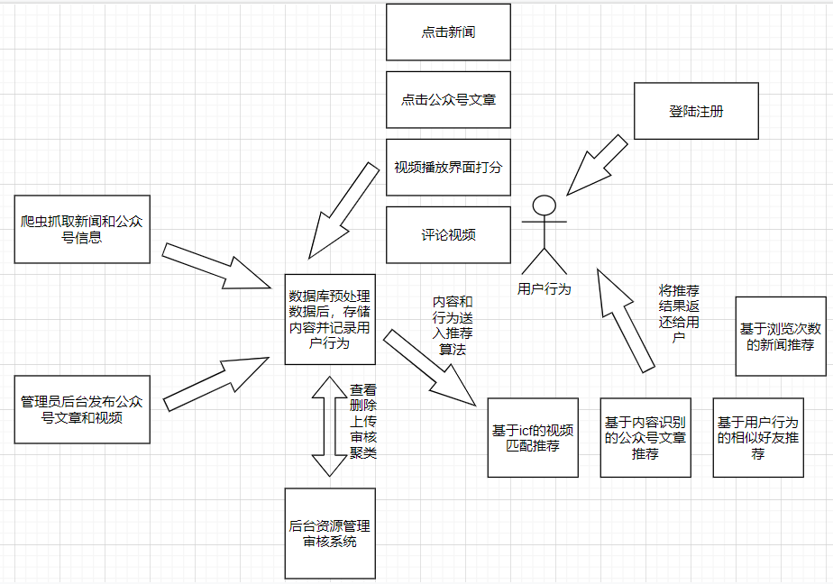
</div>

## 2.2 基于浏览量的热搜推荐

### 1）实现机制

&emsp;&emsp;
考虑到院级平台和校级平台的受众不同，基于浏览量的统计排序应该分开进行，此部分基于数据库SJTUsoso.soso_siteArticle进行，首先按照发布日期进行筛选得到近期发布的所有通知，并按照views来对院级网址和校级网站的信息分别排序，分别输出views记录最大的十条记录。即为所需热搜。

### 2）模块接口

&emsp;&emsp;
Django模型中使用ORM来实现不同类型系统的数据之间的转换，通过使用描述对象和数据库之间的映射的元数据将程序中的对象自动持久化到数据库中。此模块的实现涉及文件`SJTUsoso\blog\views.py`。在具体实现中调用filter()进行筛选，调用order_by进行排序输出。如获取院级平台2020年全年中浏览量最高的十条记录查询语句如下。

```python
qs = SosoSitearticle.objects.filter(date__range=["2020-01-01", "2020-12-31"]).order_by('-view')][:10]
```
### 3）前端设计

&emsp;&emsp;
在主页独立热搜板块，限定时间范围后按照浏览量排序选择前十条进行前端展示，每一条信息包括图片、标题、关键词、发布时间。

<div align=center>
	
</div>


## 2.3 基于物品协同过滤（ICF）的视频推荐

### 1）实现功能

* 完成了与用户系统的对接，用户只有处于登陆状态时才能获得推荐内容，同时所有推荐视频内容均匹配该用户历史行为（评分）。
* 设计并实现了推荐算法
* 设计了前端界面，包括主页上的视频推荐部分（显示了标签、日期、封面、时间、标题）以及视频播放界面（自动播放视频，包括观看人数、喜欢人数、收藏人数、综合评分、评分人数、评分框、评论框、其它用户评论）
* 完成了数据库模型的建立与后端和数据库的对接工作，使用到的模型包括Video, User, Rate, VideoComments共五个，对每个属性字段都相应做了设计
* 完成了前后端的衔接工作
    * 评分系统：用户提交评分显示提交成功或失败，评分记录在数据库
    * 评论区：用户提交评论显示提交成功或失败，评论记录在数据库；从数据库读取其它用户评论，返回到前端。
    * 推荐算法：将推荐得到的视频ID返回到前端，并相应显示


### 2）推荐算法：

* 用户评分的获取

&emsp;&emsp;
用户可以在播放界面对视频打分,并将评分记录于数据库中。

* 视频相似度矩阵

&emsp;&emsp;
基于共现矩阵和单个视频被打分的次数，通过余弦相似度构建视频之间的相似度矩阵，计算公式如下图所示。（共现矩阵描述了任意两个视频被同时打分的次数。）

<div align=center>
	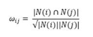
</div>

&emsp;&emsp;
分子Ni ∩ Nj为共现矩阵中的元素Nij，而分母中Ni和Nj分别为第i，第j个视频被打分视频。

* 视频推荐

&emsp;&emsp;
在视频推荐时，对于用户已打分的每个视频，比如第一个视频打分为m1,通过相似度矩阵挑选出用户未打分但相似度最高的N个视频，相似度为（n1,n2,....nN）计算推荐度为m1*n1,m1*n2....对于用户其它的打分视频也依次计算，最终取推荐度最高的前四个。

* 冷启动

&emsp;&emsp;
初始时由于用户没有打分记录或较少，无法推荐。故对于不足四个推荐项的情况，随机挑选其它视频视频补足。

### 3）算法实现

&emsp;&emsp;
这部分主要涉及 `SJTUsoso/blog/` 目录下的 `icf.py` 等数个文件。
* `ItemSimilarity()`函数建立物品-物品的共现矩阵

```python
for user, items in self.train.items():
    for i in items.keys():
        buy.setdefault(i, 0)
        buy[i] += 1
        cooccur.setdefault(i, {})
        for j in items.keys():
            if i == j: continue
            cooccur[i].setdefault(j, 0)
            cooccur[i][j] += 1
```                   

* 计算相似度矩阵

```python
for i, related_items in cooccur.items():
    self.similar.setdefault(i, {})
    for j, cij in related_items.items():
        self.similar[i][j] = cij / (math.sqrt(buy[i] * buy[j]))
```   

* `Recommend()`函数返回给用户推荐的视频ID，包括前K个相关用户以及前N个物品

```python
    def Recommend(self, user, K=10, N=10):
        rank = dict()
        action_item = self.train[user]
        # 用户user产生过行为的item和评分
        for item, score in action_item.items():
            sortedItems = sorted(self.similar[item].items(), key=lambda x: x[1], reverse=True)[0:K]
            for j, wj in sortedItems:
                if j in action_item.keys():
                    continue
                rank.setdefault(j, 0)
                rank[j] += score * wj
        return dict(sorted(rank.items(), key=lambda x: x[1], reverse=True)[0:N])
```   

### 4）数据结构

&emsp;&emsp;
本功能模块在model.py中使用的模型类有Video, VideoComments , Rate,其中对于数值类型的字段定义为IntegerField并设置缺省值为0，对于字符类型的字段定义为CharField并设置其最大长度，同时直接在评分模型中提供返回均值的函数，便于更新视频模型中的综合评分。

&emsp;&emsp;
Video中包含的字段有标题、标签、视频路径、日期、封面路径、喜欢人数、收藏人数、浏览人数、打分人数、平均分等；
VideoComments中包含的字段有内容、用户ID、视频ID、昵称、日期；
Rate中包含的字段有视频ID、用户ID、评分、日期

### 5）后端逻辑

&emsp;&emsp;
由于django基于MVC框架，主要修改html(前端页面) / urls(根据url请求跳转页面)/ views（后端处理函数）/models（数据库模型）。主页面中视频推荐的程序逻辑实现如下图所示：

<div align=center>
	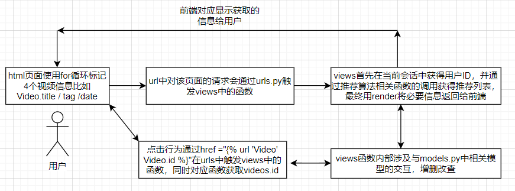
</div>

&emsp;&emsp;
视频播放的程序逻辑实现类似，不同的是：
* 数据库中维护一张视频评分表blog_videocomments，用户评分的行为是通过post请求送到后端记录的。

* 视频播放页面包括视频播放、评论查看、评论编辑、用户评分、喜欢收藏浏览人数的显示，对应从数据库表格中读取，在后端以Query set、字典、列表或者元素的形式送入前端显示即可。提交评论一样使用Post请求。

### 6）前端设计

&emsp;&emsp;
使用Html/css及其相关元素实现，包括主页上的视频推荐部分（显示了标签、日期、封面、时间、标题）以及视频播放界面（自动播放视频，包括观看人数、喜欢人数、收藏人数、综合评分、评分人数、评分框、评论框、其它用户评论），对需要后端返回的部分使用{{  }}标记即可。

<center class="half">
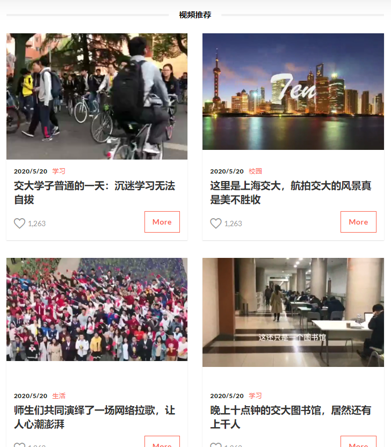

</center>  


## 2.3 基于内容的公众号文章推荐

### 1）实现功能
* 完成了与用户系统的对接，用户只有处于登陆状态时才能获得推荐内容，同时所有推荐公众号文章内容均匹配该用户历史行为（点击）
* 设计并实现了推荐算法
* 设计了前端界面，包括主页上的公众号文章推荐部分（显示了标签、日期、封面、时间、标题、摘要）以及文章查看界面（标题、摘要、内容）
* 完成了数据库模型的建立与后端和数据库的对接工作，使用到的模型包括Wechats、User，对每个属性字段都相应做了设计
* 完成了前后端的衔接工作
    * jieba分词及关键词权重计算：该工作在管理员提交文章时进行
    * 实现了用户特征的提取：用户的点击行为伴随着用户兴趣关键词的变化
    * 推荐内容匹配度最高的文章ID返回到前端显示给用户
    * 关键词的兴趣衰减：后台周期任务

### 2）推荐算法

#### 算法原理：
* 后台上传：\
    在基于内容的文章推荐中，首先对于后台上传的公众号文章内容，会将其进行预处理：
    * 去除特殊符号、非关键字的常用汉字、数字字母，它们在目录static\data\puntuation.txt中被指定
    * 对文本内容进行结巴分词，使用结巴的cut_for_search模式提取更多关键词
    * 利用TFIDF算法和库内其它文本一起，计算出该文本的关键词及权值。

* 兴趣关键词
维护每个用户的兴趣关键词及权重，兴趣关键词的获得与用户点击公众号文章相关，每查看一篇文章便会获得该文章的关键词及权重，对于关键词重复的情况将权值累加，同时每次添加兴趣关键词后，按权值排序，取前1000个。

* 文章推荐
而后便可以相应进行文章推荐，推荐方法为根据根据用户的兴趣关键词及权值和各个文本的关键词及权值，以此计算相似度，计算方法为将相同关键词的权值乘积的累加。并最终挑选4个相似度最高的进行推荐。

* 兴趣衰减
考虑到用户兴趣会随着时间推移而改变，失去兴趣的关键词依然保持高权值是不合理的，因而周期性降低各词权值。

#### 算法实现：

这部分主要涉及 `SJTUsoso/blog/` 目录下的 `renew_tfidf.py`

* jieba分词

```python
strs = []
strs.append(' '.join(jieba.cut_for_search(str)))

```
* CountVectorizer.fit_transform() 函数利用文本中分词后的词语计算tfidf值
* TfidfTransformer.fit_transform() 将计算得到的tfidf值转换为词频矩阵，矩阵元素a[i][j] 表示j词在i个文本下的词频
* get_feature_names() 方法获取词袋模型中的所有词语
* tfidf.toarray() 方法可将tf-idf词频矩阵抽取出来

### 3）数据结构

&emsp;&emsp;
本功能模块在model.py中主要使用的模型类有User和Wechat,其中对于数值类型的字段定义为IntegerField并设置缺省值为0，对于字符类型的字段定义为CharField并设置其最大长度。Wechat中使用的主要字段为标题、摘要、标签、图片、日期、内容。

### 4）后端逻辑

&emsp;&emsp;
实现思路框图与基于icf的视频推荐类似，不同之处在于：
* `index.html`及`blog/views.py`中的tohome() 函数处理主页上关于公众号的内容推送，即后端通过上述推荐算法返回一个 queryset 对象 Wechats，前端使用for循环显示相应信息。
* `upload.html`及`myadmin/views.py`中的wechat_post() 函数负责上传的公众号文章内容的预处理工作(包括去除符号及常用汉字去除、jieba分词、tfidf找出关键词及权重)。
* `single.html`及`blog/views.py`中的tosingle() 函数处理用户点击行为，一方面返回相应文章内容，同时完成用户兴趣关键词更新的工作。
```python
    if not os.path.exists(filename2): #用户兴趣关键词不存在
        #直接引入文章关键词
        user_dict={}
        for i in dicts[str(Wechat_id)].keys():
            if i in user_dict.keys():
                user_dict[i]+=dicts[str(Wechat_id)][i]
            else:
                user_dict[i]=dicts[str(Wechat_id)][i]
    else:   #用户兴趣关键词存在
        #将文章关键词补充进去
        with open(filename2) as file_obj:
            user_dict = json.load(file_obj)
        file_obj.close()
        for i in dicts[str(Wechat_id)].keys():
            if i in user_dict.keys():#相同的累加
                user_dict[i] += dicts[str(Wechat_id)][i]
            else:#不同的单独放进
                user_dict[i] = dicts[str(Wechat_id)][i]

        user_dict = dict(sorted(user_dict.items(), key=lambda item: item[1], reverse=True))
        count=0
        for i in user_dict.keys():
            count+=1 
            if (count>1000):#将权值从大到小排序，舍去1000个后的
                del user_dict[i]
```

### 5）前端设计

&emsp;&emsp;
主要使用html/css设计了前端界面，包括主页上的公众号文章推荐部分（显示了标签、日期、封面、时间、标题、摘要）以及文章查看界面（标题、摘要、内容）。

<center class="half">


</center>  


## 2.4 基于用户行为的相似用户推荐

### 1）实现机制：
* 用户行为1：兴趣关键词

	α = 相同关键词的权重之积相加（越大相似度越高）

* 用户行为2：视频评分
    
    对本用户和其它用户的视频打分，计算标准差，即：
    β = 差的平方的和，求均值再开根号。（越小相似度越高，未打分的视频分数为0。）

任意两个用户的相似度为 （α+1） / （β + 1），并取相似度最高的十个用户显示在前端。（+1是为了处理不存在相同关键词或者两用户都未对视频进行评分的情况）

### 2）模块接口与前后端：
这部分主要涉及 `SJTUsoso/blog/` 目录下的 `recom_friend.py`
* search_friend()实现了上述功能
* `index.html`及`blog/views.py`中的tohome() 函数处理主页上相似好友的推荐。

# 3 社交博客平台

## 3.1 用户系统

### 1）功能设计

&emsp;&emsp;
为了能够较全面地满足用户的使用需求，一套完整的用户系统是必不可少的。用户系统的设计模仿 _[CSDN BLOG](https://www.csdn.net)_，有用户**账户系统、博客系统、用户收藏**三个部分，分别对应**用户账户管理、用户思想交流、用户兴趣爱好**三个需求。

<div align=center>
	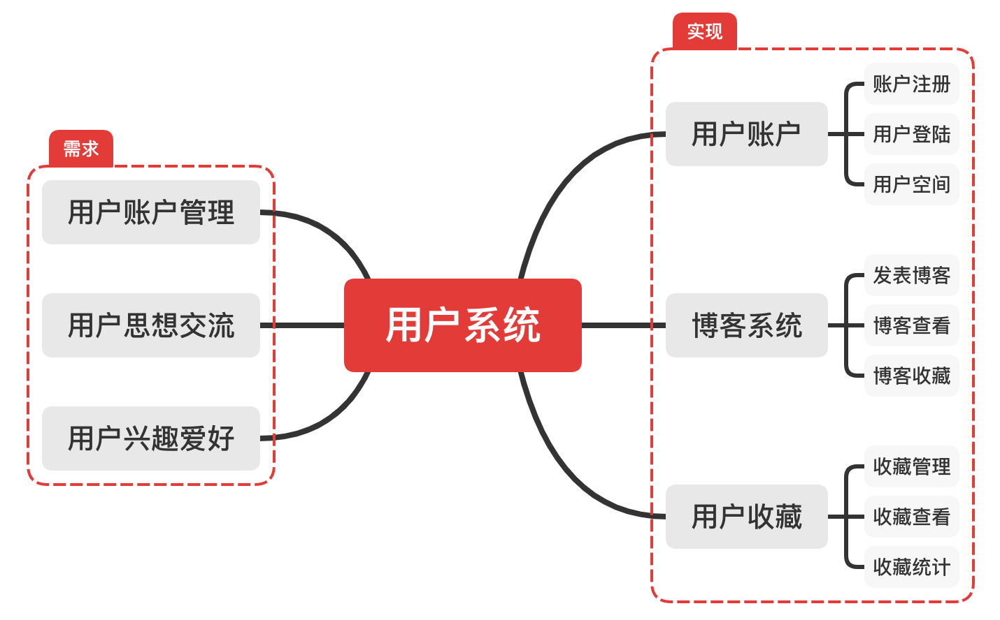
</div>

### 2）账户系统

&emsp;&emsp;
账户系统有**账户注册、用户登陆、用户登出、修改密码、用户空间**等5个功能。各功能与其 _URL_ 分配如下图。

<div align=center>
	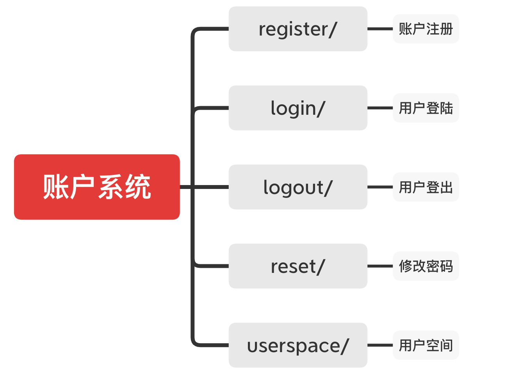
</div>

#### models & session

&emsp;&emsp;
用户账户的 __model__ 定义了用户信息在数据库中存储的数据表格式。

<div align=center>
	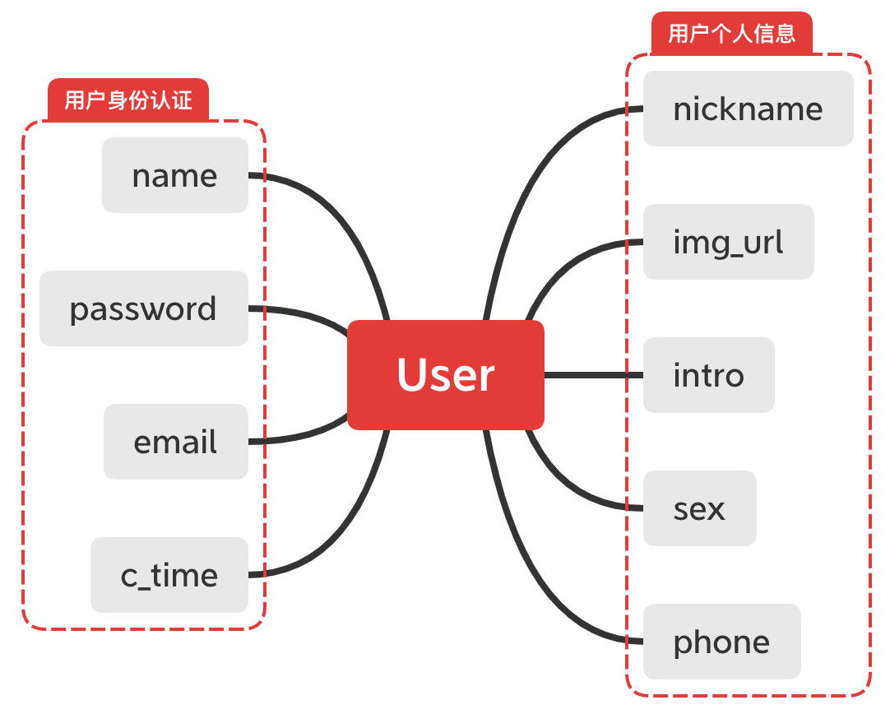
</div>

```python
class User(models.Model):
    '''用户表'''
    gender = (
        ('private', '内緒だよ〜'),
        ('male','男'),
        ('female','女'),
    )
    img_url = models.ImageField(upload_to='images', blank=True)
    name = models.CharField(max_length=128,unique=True)
    nickname = models.CharField(max_length=128, default='Freshman')
    intro = models.CharField(max_length=1024, default='Freshman')
    password = models.CharField(max_length=256)
    email = models.EmailField(unique=True)
    phone = models.CharField(max_length=128, blank=True)
    sex = models.CharField(max_length=32,choices=gender, default='内緒だよ〜')
    c_time = models.DateTimeField(auto_now_add=True)

    def getImage(self):
        if self.img_url:
            return self.img_url.url
        else:
            return os.path.join("/media/images", "avatar-" + str(random.randint(1, 8)) + ".jpg")

    def __str__(self):
        return self.name
    class Meta:
        ordering = ['c_time']
        verbose_name = 'user'
        verbose_name_plural = 'user'
```

&emsp;&emsp;
为了实现连接状态的保持功能，网站会通过用户的浏览器在用户机器内被限定的硬盘位置中写入一些数据，也就是所谓的 _Cookie_。通过 _Cookie_ 可以保存一些诸如用户名、浏览记录、表单记录、登录和注销等各种数据。但是这种方式非常不安全，因为 _Cookie_ 保存在用户的机器上，如果 _Cookie_ 被伪造、篡改或删除，就会造成极大的安全威胁，因此，现代网站设计通常将 _Cookie_ 用来保存一些不重要的内容，实际的用户数据和状态还是以 _Session_ 会话的方式保存在服务器端。

&emsp;&emsp;
__Django__ 提供了一个通用的 _Session_ 框架，并且可以使用多种 __session__ 数据的保存方式：

- 保存在数据库内
- 保存到缓存
- 保存到文件内
- 保存到cookie内

&emsp;&emsp;
本项目使用保存在数据库内的session数据的保存方式。__session__ 保存的用户信息如下：

<div align=center>
	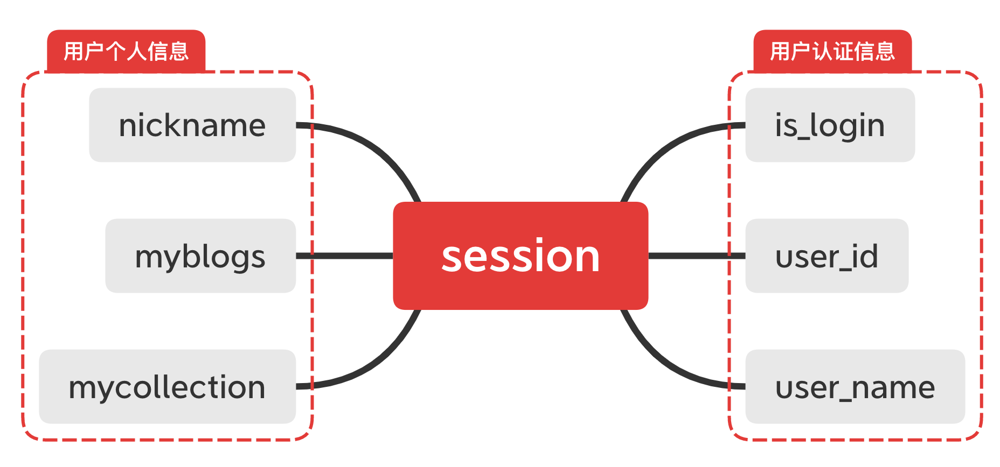
</div>

### 3）账户注册

&emsp;&emsp;
用户账户注册使用邮箱认证，对密码进行哈希加密(`sha256`)后再存储到数据库中。

&emsp;&emsp;
用户注册的 `form` 如下：

```python
class RegisterForm(forms.Form):
    username = forms.CharField(label="用户名", max_length=128, widget=forms.TextInput(attrs={'class': 'form-control'}))
    password1 = forms.CharField(label="密码", max_length=256, widget=forms.PasswordInput(attrs={'class': 'form-control'}))
    password2 = forms.CharField(label="确认密码", max_length=256, widget=forms.PasswordInput(attrs={'class': 'form-control'}))
    email = forms.EmailField(label="邮箱地址", widget=forms.EmailInput(attrs={'class': 'form-control'}))
    captcha = CaptchaField(label='验证码')
```

&emsp;&emsp;
用户注册流程图如下：

<div align=center>
	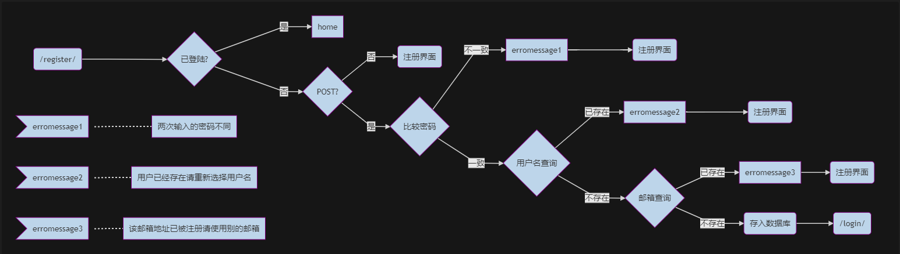
</div>

##### **前端设计如下图：**


<div align=center>
	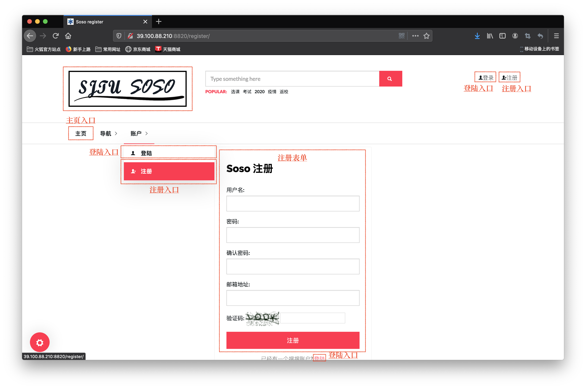
</div>

### 4）用户登陆

&emsp;&emsp;
登录时使用用户名-密码方式登陆，密码进行哈希加密(`sha256`)后再与后端数据库中的哈希值进行对比。用户登陆的 `form` 如下：

```python
class UserForm(forms.Form):
    username = forms.CharField(label="用户名", max_length=128, widget=forms.TextInput(attrs={'class': 'form-control'}))
    password = forms.CharField(label="密码", max_length=256, widget=forms.PasswordInput(attrs={'class': 'form-control'}))
    captcha = CaptchaField(label='验证码')
```

&emsp;&emsp;
用户登陆流程图如下：

<div align=center>
	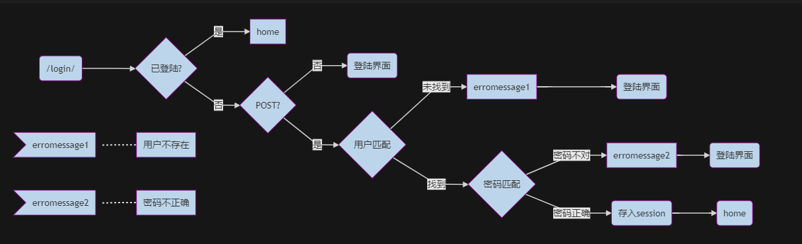
</div>

- 未登陆

<div align=center>
	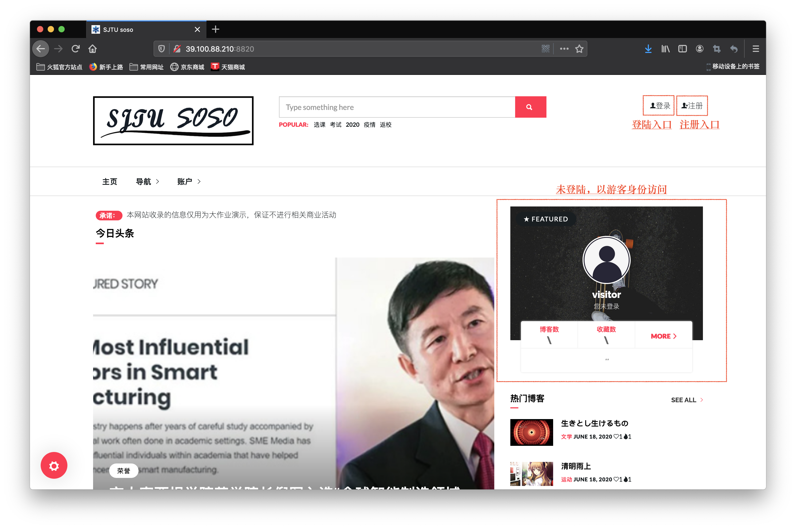
</div>

- 登陆界面

<div align=center>
	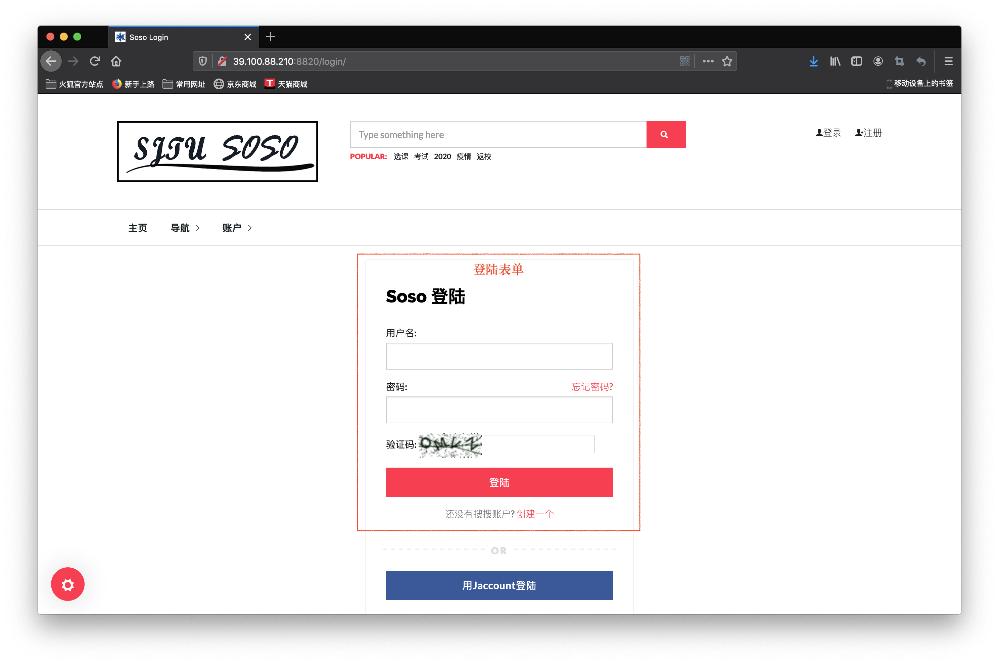
</div>

- 登陆后

<div align=center>
	
</div>

### 5）用户登出

&emsp;&emsp;
用户登出时清空所有 __session__。

<div align=center>
	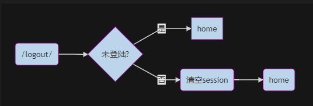
</div>

### 6）修改密码

&emsp;&emsp;
修改密码采用先验证当前密码，再允许修改密码的方式。

<div align=center>
	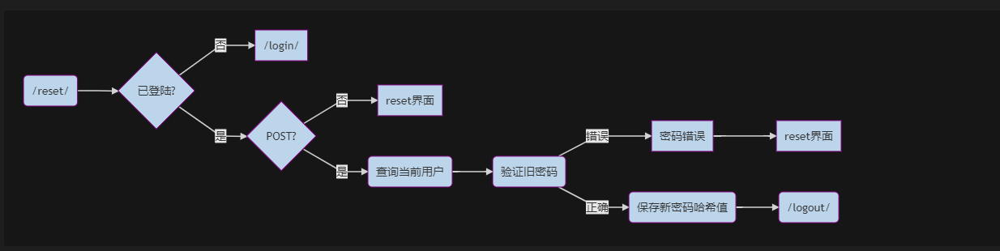
</div>

### 7）用户空间

&emsp;&emsp;
用户空间是用户系统非常重要的一个模块，让用户能够管理或展示自己的个人信息。用户空间个人信息修改或展示的表单如下：

```python
class UserspaceForm(forms.Form):
    gender = (
        ('private', '内緒だよ〜'),
        ('male', '男'),
        ('female', '女'),
    )
    nickname = forms.CharField(label="用户昵称", max_length=128, widget=forms.TextInput(attrs={'class': 'form-control'}))
    phone = forms.CharField(label="电话号码", widget=forms.NumberInput(attrs={'class': 'form-control'}))
    sex = forms.ChoiceField(label='性别', choices=gender, widget=forms.Select(attrs={'class': 'form-control'}))
    intro = forms.CharField(label="个性签名", max_length=1024, widget=forms.TextInput(attrs={'class': 'form-control'}), required=False)
```

&emsp;&emsp;
用户空间的互访是通过 __GET__ 方式在 _URL_ 中指定用户名访问指定用户的用户空间。如 `/userspace/?user=superuser` 即访问用户名为 `superuser` 的用户的个人空间。

&emsp;&emsp;
此外，在用户空间中能进行用户头像的上传与修改。若用户没有自定义头像，则系统将在默认的八张头像中随机选择一张作为用户的临时头像。


<div align=center>
	
</div>


## 3.2 博客与收藏系统

&emsp;&emsp;
博客与收藏系统有 __博客撰写与发布、博客列表、博客查看、博客收藏__ 等功能。各功能与其 _URL_ 分配如下图。

<div align=center>
	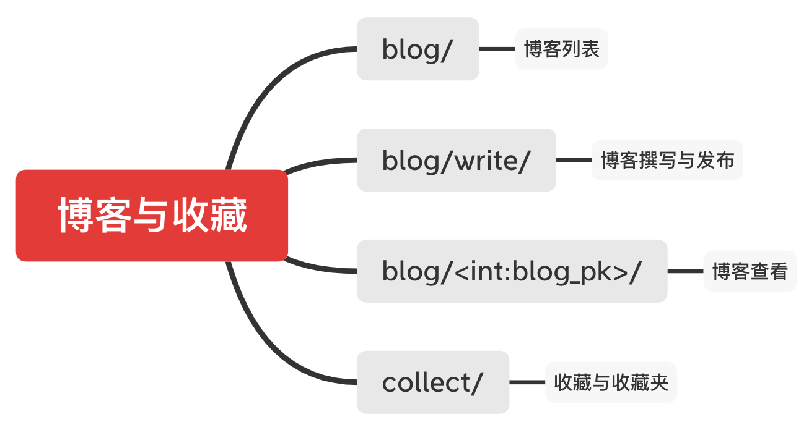
</div>

### 1）models

&emsp;&emsp;
博客的 __model__ 定义了博客在数据库中存储的数据表格式。

<div align=center>
	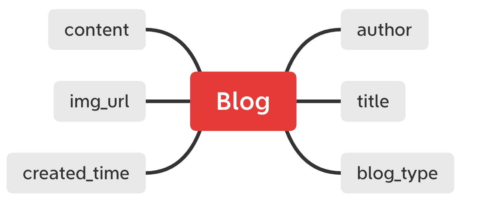
</div>

```python
class Blog(models.Model,ReadNumExpandMethod,LikeNumExpandMethod):
    author = models.CharField(max_length=128, default='-')
    title = models.CharField(max_length=50)
    blog_type = models.CharField(max_length=50, default='-')
    content = RichTextUploadingField()
    created_time = models.DateTimeField(auto_now_add=True)
    last_updated_time = models.DateTimeField(auto_now=True)
    create_month = models.CharField(max_length=50,blank=False,default=calendar.month_name[int(time.localtime().tm_mon)])
    img_url = models.ImageField(upload_to='images',blank=True)
    like_num = models.IntegerField(default=0)
    def __str__(self):
        return "<Blog: %s>" % self.title
    def getImage(self):
        if self.img_url:
            return self.img_url.url
        else:
            return os.path.join("/media/images","project-"+str(random.randint(1,8))+".jpg")
    class Meta:
        ordering = ['-created_time']
```

&emsp;&emsp;
收藏的 __model__ 定义了收藏在数据库中存储的数据表格式。

<div align=center>
	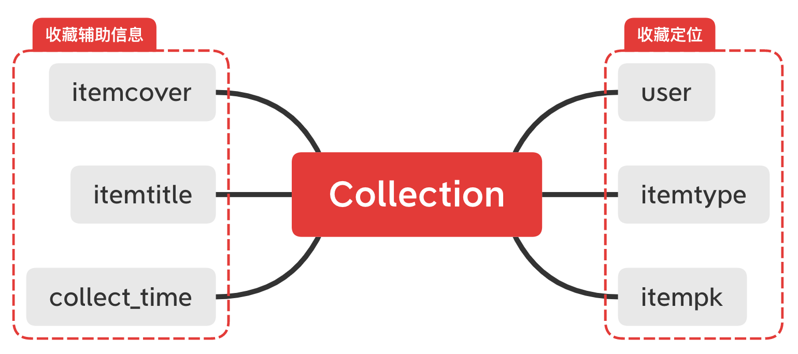
</div>

```python
class Collection(models.Model):
    user = models.CharField(max_length=128)
    itemtype = models.CharField(max_length=50)
    itemtitle = models.CharField(max_length=50)
    itempk = models.CharField(max_length=50)
    itemcover = models.ImageField(upload_to='images', blank=True)
    collect_time = models.DateTimeField(auto_now_add=True)
    collect_month = models.CharField(max_length=50, blank=False, default=calendar.month_name[int(time.localtime().tm_mon)])
    def getImage(self):
        if self.itemcover:
            return self.itemcover.url
        else:
            return os.path.join("/media/images","project-"+str(random.randint(1,8))+".jpg")
```

### 2）博客撰写与发布

博客撰写采用 __Django-ckeditor__ 富文本编辑器，支持基本的博客撰写与发布能力。编辑器配置如下：

```python
CKEDITOR_CONFIGS = {
    'default': {},
    'comment_ckeditor': {
        'toolbar': 'custom',
        'toolbar_custom': [
            ['Bold', 'Italic', 'Underline', 'Strike', 'Subscript', 'Superscript'],
            ["TextColor", "BGColor", 'RemoveFormat'],
            ['NumberedList', 'BulletedList'],
            ['Link', 'Unlink'],
            ["Smiley", "SpecialChar", 'Blockquote'],
        ],
        'width': '100%',
        'height': '300',
        'tabSpaces': 4,
        'removePlugins': 'elementspath',
        'resize_enabled': False,
    }
}
```

博客发布后能修改博客封面（若不修改则系统将在八张默认封面中随机挑选一张作为博客封面）。

### 3）博客列表

&emsp;&emsp;
博客列表功能支持博客分类查找，博客热度、创建时间排序，用户博客互访。通过 __GET__ 方式，在 _URL_ 中确定博客列表形式。如 `/blog/?typename=文学` 指定列出所有 `文学` 类型的博客；`/blog/?user=superuser` 指定列出作者为用户名 `superuser` 的用户的所有博客（若用户为当前登陆用户，则可以在博客空间中进行博客的增删）；`/blog/` 列出系统中所有博客。博客列表默认以创建时间排序，并在推荐栏以阅读量、收藏量排序进行热度推荐。

- 首页博客推荐与博客入口

<div align=center>
	
</div>

- 博客列表

<div align=center>
	
</div>

- 个人博客空间

<div align=center>
	
</div>

### 4）博客查看

&emsp;&emsp;
_URL_ 中的博客 _id(pk)_ 指定特定博客查看正文。博客包括博客封面、博客类型、博客标题、博客正文、博客作者等部分。可以在博客界面收藏或取消收藏博客。博客界面还有访问作者用户空间的入口。

<div align=center>
	
</div>

<div align=center>
	
</div>

### 5）收藏系统

&emsp;&emsp;
通过 __GET__ 方式，在 _URL_ 中确定系统操作。`/collect/?user=superuser` 指定查看用户 `superuser` 的收藏夹；`/collect/?key=blog-1` 命令系统将类型为 `blog`，在 `blog` 中主键编号为 `1` 的项目加入当前用户收藏夹；`/decollect/?key=3` 命令系统将数据库的收藏表中主键编号为 `3` 的项目删去。理论上该系统不止是可以收藏博客，且可以收藏任意类型的项目，但由于未整合进其他同学的部分，目前只收藏博客。

<div align=center>
	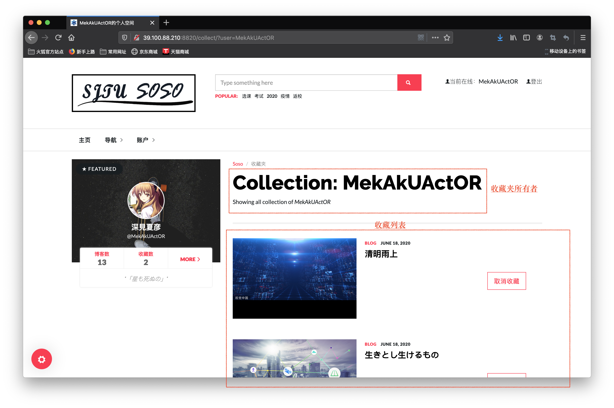
</div>

### 6）GPT-2 模型自动生成博客文本

#### 实现机制

&emsp;&emsp;
项目应用了组员的小作业项目[「基于 GPT-2 的文本生成器」](https://github.com/nyLiao/negoto)，进行博客文章的生成，以作为博客调试和展示的应用。
* 使用机器学习框架 PyTorch，调用 GPT-2 模型，生成多段完整、上下关联的散文文本，适宜博客文体。
* 生成其他相关数据，构成完整的 `Blog` 模型，使用 Django 框架进行数据管理。
* 使用训练的中文散文模型，生成了 50 篇散文文本。以下为文本的一个例子。

> **《写一写经历的友人》**  
> 我在想：“写一篇散文，需要一点淡淡的雅兴，就能够再度沉醉在这样宁静淡泊的氛围里，不以物喜，不以己悲，写一点小文字吧！” 
> 我们常常会在一个地方长久的等待。这就是我们每个人的期待，也许是生活中不可缺少的一部分。但是，我长大了，毕业了。

#### 模块接口

&emsp;&emsp;
这部分主要涉及 `SJTUsoso/blog/` 目录下的 `genBlog.py` 等数个文件。
* `generate_class.genModel`：negoto 项目的模型调用接口，此处重写了文本后处理方法。
* `genBlog.py`：文本生成文件，主要接口包括：
    * `gen_title()` 使用随机组合方法生成标题；
    * `gen_content()` 根据标题和上文调用 NLG 模型，生成博客内容；
    * 其他 I/O 接口。
* `blog_gen2.py`：文本处理文件，读入生成的 JSON 文件，新建 Django 的 `Blog` 模型，并写入数据库。


## 3.3 BBS论坛

&emsp;&emsp;
为丰富项目的功能性，在项目的社交博客平台我们搭建了一个简易的BBS小型 论坛系统。BBS论坛模块实现了一般论坛的主要功能，包括发帖，评论，评论回复，点赞，收藏，热门排序，最新排序，我的帖子管理。由于是参考blog系统独立开发，并未直接使用网络上普遍的forum论坛系统，其中消息通信、用户交互、评论提醒等功能还不太完善，但是作为一个BBS的基本功能都全部实现。其中论坛系统的总设计图如下：

<div align=center>
	
</div>

### 1）登录注册功能

&emsp;&emsp;
其中登录注册功能是与交大搜搜项目的用户系统对接，在用户未登录之前，只能查看论坛内的帖子，只有在登录之后才能进行发帖、点赞、收藏、个人帖子管理等与用户相关的操作。

<div align=center>
	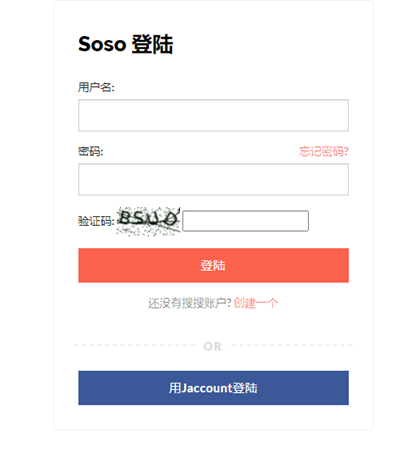
</div>

### 2）论坛主页

&emsp;&emsp;
在论坛主页分为五个板块，分别是热门、最新、点赞、收藏、我的。可以显示热门帖子主题、发帖人、浏览量、点赞数等信息，下方是发帖使用的Tiny_MCE富文本编辑器，发帖方便快捷。通过get方式，判断URL处于/message_boards/1/1/，便获取论坛内容，并构建分页器，构造每一页需要渲染的数据列表，达到以下显示效果：

<div align=center>
	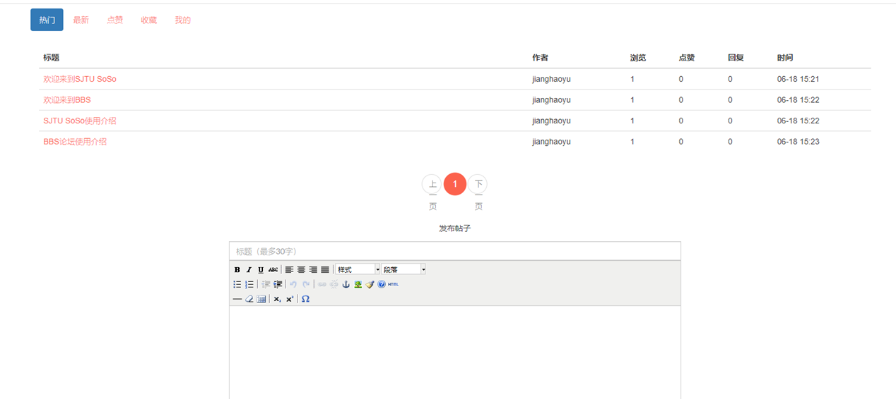
</div>

- 帖子的models

&emsp;&emsp;
帖子的 model 定义了帖子在数据库中存储的数据表格式。

```python
class MessageBoard(models.Model):
    # 读书论坛
    user = models.ForeignKey(User, on_delete=models.CASCADE, verbose_name="用户")
    title = models.CharField(max_length=64, verbose_name="标题")
    content = models.TextField(verbose_name="内容")
    look_num = models.IntegerField(verbose_name='点击数', default=1)
    like_num = models.IntegerField(verbose_name='点赞数', default=0)
    feebback_num = models.IntegerField(verbose_name='回复数', default=0)
    collect_num = models.IntegerField(verbose_name='收藏数', default=0)
    create_time = models.DateTimeField(auto_now_add=True)

    class Meta:
        verbose_name = "留言"
        verbose_name_plural = verbose_name
   ```     

- Tiny_MCE富文本编辑器配置

&emsp;&emsp;
帖子编写采用 Tiny_MCE 富文本编辑器，支持基本的撰写与发布能力。编辑器配置如下：

```python
<script src="/static/js/jquery.min.js"></script>
    <script src='/static/tiny_mce/tiny_mce.js'></script>
    <script type="text/javascript">
        tinyMCE.init({
            'mode': 'textareas',
            'theme': 'advanced',
            'width': 800,
            'height': 300,
            'language': 'zh',
            'style_formats': [
                {'title': 'Bold text', 'inline': 'b'},
                {'title': 'Red text', 'inline': 'span', 'styles': {'color': '#ff0000'}},
                {'title': 'Red header', 'block': 'h1', 'styles': {'color': '#ff0000'}},
                {'title': 'Example 1', 'inline': 'span', 'classes': 'example1'},
                {'title': 'Example 2', 'inline': 'span', 'classes': 'example2'},
                {'title': 'Table styles'},
                {'title': 'Table row 1', 'selector': 'tr', 'classes': 'tablerow1'}
            ],
        });
```

### 3）帖子的详情页面

&emsp;&emsp;
点击帖子标题可进入帖子详情页面，在此可浏览帖子内容，进行点赞，收藏，写评论等相关操作。先判断是否通过用户的session获取到user_name，并通过POST.get得到点赞或收藏的message_board_id，通过判断，将like_num或者collect_num传入数据库储存。

<div align=center>
	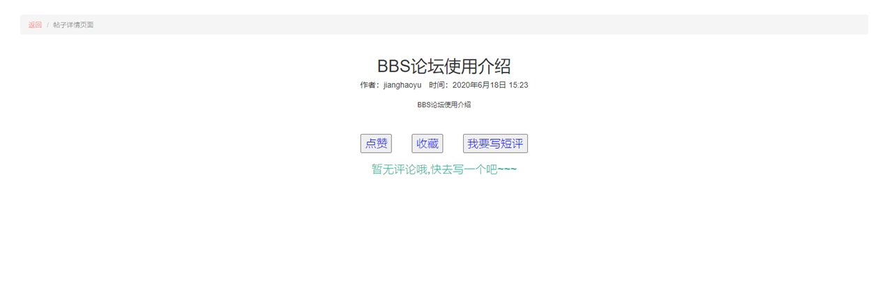
</div>

### 4）帖子评论

&emsp;&emsp;
点击我要写短评，便可进入评论的富文本编辑框，编辑评论发布后，可在帖子详情页面查看到评论情况。通过 GET 方式，在 URL 中确定系统操作。进入/new_board_comment/发表论坛评论。 

<div align=center>
	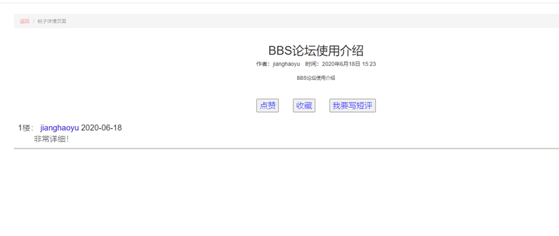
</div>

### 5）帖子收藏管理

&emsp;&emsp;
在收藏界面可以查看已收藏的帖子，点击“我的”可以管理自己的帖子，在后台管理员网站可以对论坛帖子进行管理。

<div align=center>
	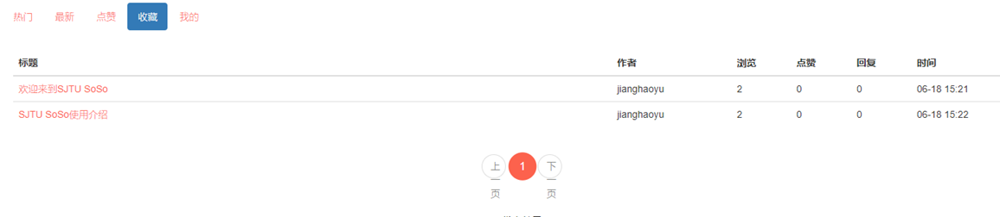
</div>

<div align=center>
	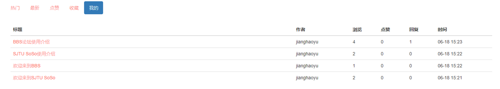
</div>


# 4 后台管理平台

&emsp;&emsp;
对于一个完整的信息聚合网站而言，除了用户界面，还要实现后台管理界面。包括实现管理员对资源的查看、删除、发布，以及站点资源的统计、审核，同时也希望能开展一定程度的数据挖掘用户定位的工作。

## 4.1 资源管理


### 1）功能视图

&emsp;&emsp;
在资源管理方面共实现了以下四种功能：
* 资源查看、资源发布、资源删除

&emsp;&emsp;
包括新闻资源、视频资源、公众号文章资源
* 资源统计

&emsp;&emsp;
包括新闻资源、视频资源、公众号文章资源、用户数、评论数、评分数的统计

### 2）资源查看

* 实现方法与主页面上推荐内容的显示，从前端标记，到urls解析，到views从models中读取相关数据并处理，继而返回前端。
* `templates/user`中的`item.html`和`item2.html`以及`myadmin/views.py`中的tovideo_resource() towechat_resource()函数实现了公众号和视频资源的查看。使用Paginator()方法保证一页显示5个资源，并且实现翻页。

```python
def tovideo_resource(request):
    videos = Video.objects.all()
    paginator = Paginator(videos, 5)
    current_page = request.GET.get("page", 1)
    videos = paginator.page(current_page)
    return render(request, "user/item.html", {"videos": videos, "title": "视频资源"})
```
### 3）资源统计
* `templates/user`中的`resource_count.html`和`myadmin/views.py`中的count_resource函数实现了站内资源统计，包括新闻、视频、公众号、评论、用户数目的统计。实现方法为从数据库中统计各类资源的数量。
### 4）资源发布

* `templates/user`中的`upload.html`和`myadmin/views.py`中的upload_resource函数返回了资源上传页面，并通过video_post()函数和wechat_post()函数可以发布视频和公众号文章：
    * 参数上传使用request.POST.get()函数
    * 文件上传使用request.FILES.get()函数,并且服务器将管理员上传的文件分块写入指定路径
    ```python=
        #文件上传
        myFile1 = request.FILES.get("preload", None)
        destination = open("/root/SJTUsoso/static/images/preload/" + myFile1.name, 'wb+')  # 打开特定的文件进行二进制的写操作
        for chunk in myFile1.chunks():  # 分块写入文件
            destination.write(chunk)
        destination.close()
        #参数上传
        title=request.POST.get('title','')
        tag=request.POST.get('tag','')
    
    ```
### 5）资源删除
* `myadmin/views.py`中的to_del_video和to_del_wechat函数实现了资源的删除，包括使用os.remove函数进行本地的删除以及数据库中记录的删除。

### 6）前端设计

<div align=center>
	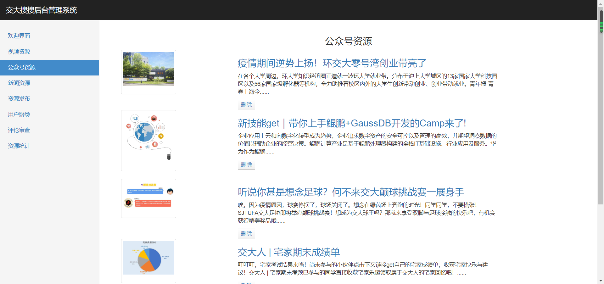
</div>


## 4.2 用户聚类

### 1）实现机制
* 评分数据读取
将用户评分从数据库中取出，以二维np.array的形式，第一维为各个用户，第二维为对各个视频的评分，送入kmeans输入。

* Kmeans聚类
使用sklearn当中的KMmeans函数实现：

```python
kmeans = KMeans(n_clusters=3, random_state=0).fit(X)
```

&emsp;&emsp;
其中聚类簇数的确定一方面要看轮廓系数以保证聚类质量，另一方面也要结合实际的用户定位需求，比如预期找出学习导向型用户或科研导向型用户等几类用户，就不必将簇数设的太大用户分的太细。

* 聚类输出
    * 输出聚类后的各相似用户组，并根据簇心坐标（簇心坐标即为该类用户对各个视频的打分），按各个视频标签统计累加，即可发现该类用户的特征，实现用户定位。

    * 比如第一组用户王小花、丁丁、雷锋，假设有N个视频，则簇心有N个坐标（N个分数），对于标签为学习一类的视频将打分相加，对于标签为校园一类的视频也将打分相加，以此类推，得出该类用户对各类标签的兴趣得分，注意到第一组用户对于校园，生活等标签的兴趣得分较高，而对学习、图书馆等标签的兴趣得分较低。

     

```python
#reuslts为之前返回的聚簇结果，通过下述代码可整合为上图所示的输出
for i in range(len(results)):
    if (i%2==0):
        scores = results[i+1]
        tag_scores={}
        for j in range(len(tag)):
            tag_scores[tag[j]]=scores[j]
        dict_category={}
        for elem in tag_diff:
            for k in tag_scores.keys():
                if k==elem:
                    if k in dict_category.keys():
                        dict_category[k]+=tag_scores[k]
                    else:
                        dict_category[k] = tag_scores[k]
        users[results[i]]=dict_category
return render(request, "user/cluster.html", {"title": "欢迎来到用户聚类界面","users": users})
```
### 2）模块接口
* 功能实现涉及 `SJTUsoso/myadmin/` 目录下的 `cluster.py`中的kmeans_cluster() 函数，调用sklearn.cluster中的KMeans函数进行聚类处理。


## 4.3 评论审查

### 1）功能视图
* 敏感条目的查看与删除
管理员可以设置敏感词并通过post提交，系统会筛选出包含该关键词的评论条目，并可根据管理员需要选择性删除。
* 垃圾评论筛查
使用阿里云内容安全Python SDK文本反垃圾接口对评论内容进行色情、暴恐、涉政等风险识别。并在网站中进行分类显示，并可由管理员选择性删除。

### 2）模块接口
前端相关文件为`templates/user`中的`check_comment.html`
* 删除功能实现为`myadmin/views.py`中的to_del_comment函数，可删除指定id的评论，并重新返回评论审查页面。

* 更新敏感关键词功能的实现为words_post函数，由管理员点击更新按钮通过post触发。服务器获取到关键词后将其保存在json文件中。
```python=
    if request.method == 'POST':
        content = request.POST.get('words', '')
        words_list = content.split(",")
        with open(r"./static/data/words.json", "w") as f:
            json.dump(words_list, f)
        return HttpResponse("关键词更新成功")
    else:
        return HttpResponse("程序错误，请回退重试")
```
* 垃圾评论筛查的工作由`myadmin/sdk.py`实现，调用sdk判断评论类别是否为非normal类型的文本，并在前端显示类别为色情、反动、广告、灌水、辱骂类型的评论，该类评论一样可以通过to_del_comment函数进行删除。

<div align=center>
	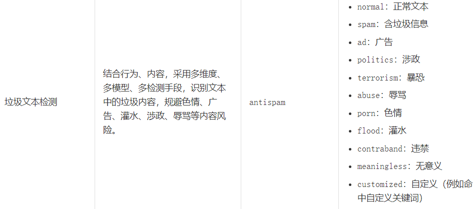
</div>


---
## A 分工
- 郭建铭

&emsp;&emsp;
负责需求分析并完成需求文档的撰写。完成信息获取和聚合部分，爬取学校平台数据，辅助完成搜索引擎聚合数据处理部分，并租借Aliyun服务器搭建数据库，完成相关设计文档的撰写并整合修改设计文档。利用服务器部署整个项目并完成部署文档的撰写。完成搜索引擎部分功能测试和全部性能测试，撰写相关文档并完成测试文档的整合排版。制作ppt和演示视频。

- 廖宁祎

&emsp;&emsp;
搜索引擎的整体搭建与功能实现；电院网页数据的爬取处理，网页数据的关键词算法设计实现；BERT 语义相似度模型训练与部署；GPT-2 博客文章生成；部分后端整合和前端优化，项目整体代码管理；文档上述相关部分撰写。

- 郭子豪

&emsp;&emsp;
负责推荐系统、后台管理平台的前后端设计与实现，并与用户系统对接；设计文档和测试文档方面负责了推荐系统和后台管理部分的撰写；此外参与了微信公众号数据的获取与论坛部分的debug。

- 刘浩文

&emsp;&emsp;
负责用户系统、博客应用的设计与实现；搜索引擎的初步搭建；部分前端的设计与制作；相关部分设计文档、测试文档的撰写。


- 江浩宇

&emsp;&emsp;
主要负责项目中社交博客平台的BBS论坛系统搭建，独立搭建类blog系统的论坛系统，实现论坛的基本功能，并与用户系统对接，同时负责前端论坛板块。并且参与前端页面优化和微信公众号数据爬取。


## B 交流协作

&emsp;&emsp;
受疫情影响，此项目的开发过程全部在线上开展，全过程利用的工具包括：

<style>
table {
margin: auto;
}
</style>


|  工具   |   说明  | 
|:----:| :----:|
| zoom  |  每周二晚上线上集中讨论已取得进展和下一步计划
| github| 代码的版本控制和协作共享
| 水源文档 | 记录讨论内容和每位成员的进展情况
| 远端数据库 | 共同调试并存储相关数据
| 云端服务器 | 共同运行并调试代码，知晓项目进度的同时寻找改进点
| 微信群 | 进行日常交流，以更好地了解其他组员的进展和技术细节