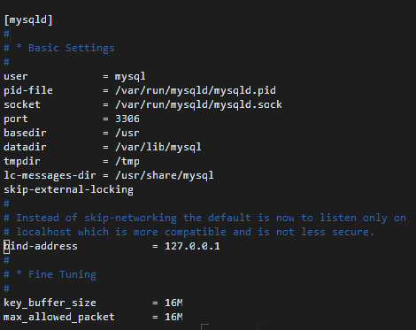
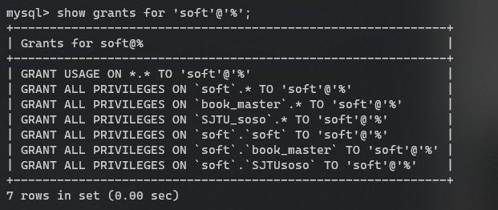
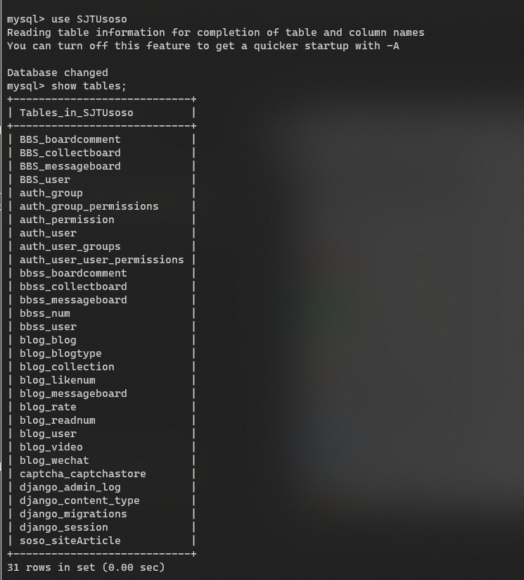

<center>
<strong>
<font face='微软雅黑' size=6> SJTU_soso部署文档 </font>
</strong>
</center>


<p align="right">
<font face='微软雅黑' size=4>郭建铭/廖宁祎/刘浩文/江浩宇/郭子豪</font>
</p>

## 1 数据库搭建

&emsp;&emsp;
本项目基于B/S架构实现，所有数据通过云端数据库进行存储、读取等操作，我们通过租借Aliyun服务器的云盘自行搭建Mysql服务端，首先安装数据库服务器端等依赖项。

```sh
apt-get install mysql-server,mysql-client
apt-get install libmysqlclient-dev
```

&emsp;&emsp;
为了小组成员的调试，还需要开启远程连接，在Aliyun控制台修改安全规则，开放3306端口后，源设置为0.0.0.0/0以供远程连接，修改my.cnf配置文件中的port、bind-address等字段。

<div align=center>
	
</div>

&emsp;&emsp;
修改相应配置后为数据库创建远程用户'soft',并授权该用户相应数据库的所有权限。
```sql
create user 'soft'@'%' identified by pd;
grant all on SJTU_soso.* to 'soft'@'%';
```

<div align=center>
	
</div>

&emsp;&emsp;
项目中所有的数据存放在数据库SJTUsoso中，存储的信息包括用户信息、博客数据、论坛数据、所有获取聚合的数据等。

<div align=center>
	
</div>

## 2 项目部署

&emsp;&emsp;
全项目基于B/S架构，采用Django框架搭建而成，考虑到易用性和功能性，将全项目部署在服务器上以便用户跨终端使用。服务器端部署过程如下。

### 2.1 建立虚拟环境

```bash
sudo apt-get install python-virtualenv
virtualenv virtualenv -p /usr/bin/python3.7 soso
source soso/bin/activate
```

### 2.2 安装依赖项

```sh
pip install -r < requirements.txt
```

项目后台部署所需依赖项如表所示：

<style>
table {
margin: auto;
}
</style>


|Package     |   Version| 
|:----:| :----:|
|asgiref                |3.2.8 |
|Django                 |3.0.7 |
|django-ckeditor        |5.9.0
|django-haystack        |2.8.1
|django-js-asset        |1.2.2
|django-mdeditor        |0.1.18
|django-ranged-response |0.2.0
|django-simple-captcha  |0.5.12
|djangorestframework    |3.11.0
|jieba                  |0.42.1
|joblib                 |0.15.1
|mysqlclient            |1.4.6
|numpy                  |1.18.5
|Pillow                 |7.1.2
|pip                    |20.1.1
|pkg-resources          |0.0.0
|PyMySQL                |0.9.3
|pytz                   |2020.1
|scikit-learn           |0.23.1
|scipy                  |1.4.1
|setuptools             |47.3.1
|setuptools-scm         |4.1.2
|simplejson             |3.17.0
|six                    |1.15.0
|sqlparse               |0.3.1
|threadpoolctl          |2.1.0
|wheel                  |0.34.2
|Whoosh                 |2.7.4


### 2.3 搜索引擎部署


&emsp;&emsp;
Django+Haystack+Whoosh 的搜索引擎在项目中属于已部署好的状态，且使用了对环境改动最小的实现方式。在部署过程中，有以下几点需要注意。

- Haystack 配置

&emsp;&emsp;
在 `SJTUsoso/SJTUsoso/settings.py` 项目配置文件 `INSTALLED_APPS` 中注册 `'haystack'`，并加入如下配置信息。
```python
# 配置引擎和索引
HAYSTACK_CONNECTIONS = {
    'default': {
        'ENGINE': 'soso.whoosh_cn_backend.WhooshEngine',
        'PATH': os.path.join(os.path.dirname(__file__), 'whoosh_index'),
    },
}
# 自动更新索引
HAYSTACK_SIGNAL_PROCESSOR = 'haystack.signals.RealtimeSignalProcessor'
# 设置每页显示的数目
HAYSTACK_SEARCH_RESULTS_PER_PAGE = 5
```
- Whoosh 使用中文分词

&emsp;&emsp;
如上所示，Haystack 使用的是 `SJTUsoso/soso/whoosh_cn_backend.py` 的自定义 Whoosh 搜索引擎。其与原 Whoosh 引擎的区别主要是 `TEXT` 内容的分析器更改为了结巴分词提供的 `jieba.analyse.ChineseAnalyzer()`。

```python
from jieba.analyse import ChineseAnalyzer
schema_fields[field_class.index_fieldname] = TEXT(
    stored=True,
    analyzer=ChineseAnalyzer(),
    field_boost=field_class.boost,
    sortable=True,
)
```

- 建立索引模型

&emsp;&emsp;
在搜索模块路径下建立索引模型文件 `SJTUsoso/soso/search_indexes.py`。该文件定义了基于网页数据 Django 模型 `SosoSitearticle` 的 `SosoSitearticleIndex` 类，作为 Haystack+Whoosh 的索引模型。其中声明的各个字段属性与 `SosoSitearticle` 的字段对应，供全文搜索时检索引用。

- 建立模型模板

&emsp;&emsp;
上步索引中定义了一个 `text` 字段，其作用是根据数据模板组合建立索引文件，数据模板中写入的字段将会被建立索引，检索时会对这些字段做全文检索匹配。数据模板保存在 `SJTUsoso/templates/search/indexes/soso/sosositearticle_text.txt` 文件中。

- 建立索引文件

&emsp;&emsp;
数据库和搜索引擎均部署完成后，在目录下使用如下命令初次建立/刷新索引文件。之后运行过程中，Haystack 会根据数据的增删动态地更新索引文件。
```python=
python manage.py rebuild_index/update_index
```

### 2.4 模型部署

- 模型概述

&emsp;&emsp;
[Google BERT](https://github.com/google-research/bert) 模型是 Google 发布的 NLP 模型。此处使用的是全尺寸版 BERT-Base，层数 12，隐藏层大小 768，自注意力头数 12，总参数个数 110M。BERT-Base Chinese 模型经过 Google 中文语料预训练。

&emsp;&emsp;
模型使用 TensorFlow 框架实现，封装的接口参考了 [terrifyzhao/bert-utils](https://github.com/terrifyzhao/bert-utils) 项目，通过对模型结构的微调实现了适用于句子对分类的 BERT 训练、评价、推断过程。

- 模型训练

&emsp;&emsp;
Google 发布的 BERT-Base Chinese 已经过了中文语料预训练。BERT 论文中也提到，针对具体任务可以通过 fine-tune 实现更好的性能。此处针对相似度计算任务，使用 [QA Corpus](http://icrc.hitsz.edu.cn/info/1037/1162.htm) 数据集。其包含训练数据 100k 条，验证、测试数据各 10k 条，均为二分类的句子匹配数据。

&emsp;&emsp;
模型在预训练起点上，应用上述语料进行 10 轮 fine-tune，保存每轮训练结果。训练参数 batch_size=64，learning rate=5.0e-5。模型在 NVIDIA GTX 1080 单 GPU 上训练全程约 6 小时。最终第 10 轮模型在测试集上正确率 62.64%。

- 模型部署

&emsp;&emsp;
模型与项目相关文件在项目目录 `bert-utils-master` 中，主要调用接口为 `bert-utils-master/similar.py` 文件，详见设计文档部分。

&emsp;&emsp;
模型在 Intel Core i5 单 CPU 下进行相似度分析计算时，处理速率超过 10 条/秒（不计数据库存取时间，视输入句子长短略有不同），性能表现还是较好的。

## 3 项目运行

&emsp;&emsp;
在控制台修改规则，开放8820以供项目部署，并授权对象给0.0.0.0/0以供用户连接。
借助django的runserver运行项目，并部署在8820端口
```sh
python3 manage.py runserver 0.0.0.0:8820
```

<div align=center>
	
</div>